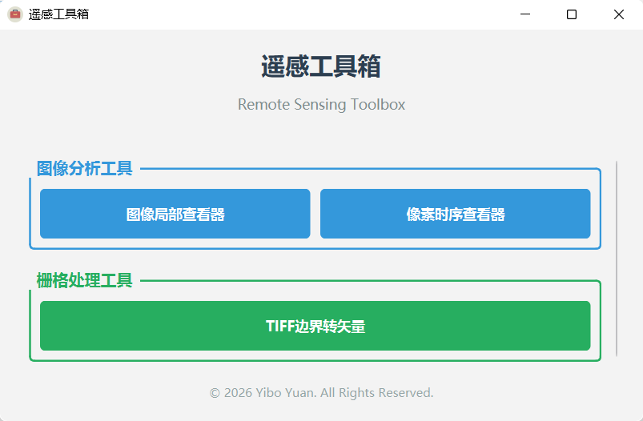
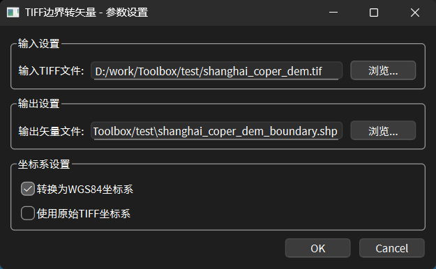
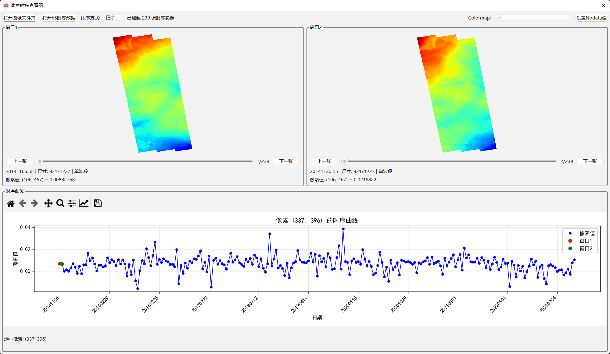
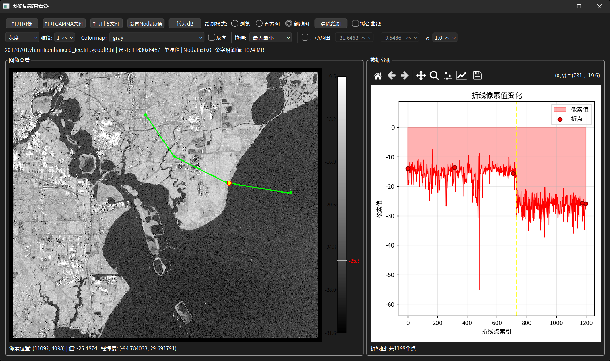
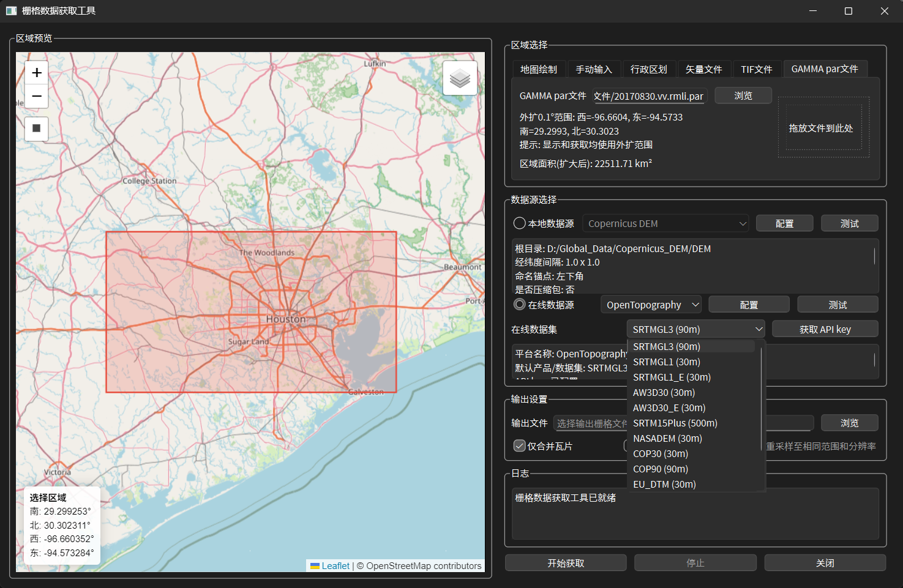

# Toolbox - 遥感工具箱

一个基于PySide6开发的遥感数据处理与分析工具箱，提供便捷的栅格数据处理、时序分析和可视化功能。

## 项目简介

本项目旨在打造一个功能丰富、易用的遥感数据处理工具箱，整合常用的遥感数据分析功能，提供友好的图形界面，降低遥感数据处理的门槛。

# Toolbox - 遥感工具箱

一个基于 PySide6 的遥感数据处理与分析工具箱，提供便捷的栅格数据处理、时序分析和可视化功能。

## 项目简介

本项目旨在打造一个功能丰富、易用的遥感数据处理工具箱，整合常用的遥感数据分析功能，提供友好的图形界面，降低遥感数据处理门槛。

## 已完成功能

<p align="center">
  
</p>

### 1. TIFF 边界转矢量

根据导入的 TIFF 数据，将其矩形边界转成矢量数据

- 支持导出多种矢量格式
- 支持坐标系统设置

**使用方法：**

1. 点击主界面"TIFF边界转矢量"按钮
2. 选择要处理的TIFF文件
3. 在设置对话框中配置坐标系统和输出格式（支持Shapefile、KML等）
4. 点击"确定"生成矢量边界文件

<p align="center">
  
</p>

### 2. 像素时序查看器

导入时序数据，查看每个像素的时序曲线

- 支持 TIFF/GeoTIFF 时序影像、 MintPy h5 时序形变数据以及GAMMA二进制时序数据
- 双图像窗口同步显示

**使用方法：**

1. 点击主界面"像素时序查看器"按钮
2. 选择数据类型：
   - **TIFF时序**：点击"打开TIFF文件夹"，选择包含时序TIFF文件的文件夹
   - **h5文件**：点击"打开h5文件"，选择MintPy生成的h5文件
   - **GAMMA时序**：点击"打开GAMMA时序数据"，选择包含GAMMA二进制文件的文件夹（自动检测PAR文件）
3. 使用滑块切换不同时间点的影像
4. 在图像上点击像素，右侧图表显示该像素的时序曲线
5. 可调整colormap、缩放图像、导出数据、将GAMMA强度数据转为dB形式

<p align="center">
  
</p>

### 3. 图像局部查看器

绘制矩形查看局部区域直方图，绘制折线查看沿线像素变化曲线

- 支持 TIFF/GeoTIFF、PNG、JPG 等常见格式、MintPy h5 数据文件以及GAMMA二进制文件
  **使用方法：**

1. 点击主界面"图像局部查看器"按钮
2. 打开图像文件：
   - **常规图像**：点击"打开图像"选择TIFF/PNG/JPG等文件
   - **h5文件**：点击"打开h5文件"，选择数据集
   - **GAMMA文件**：点击"打开GAMMA文件"，选择二进制文件（自动或手动选择PAR参数文件）
3. 使用绘图工具：
   - **矩形工具**：点击"绘制矩形"，在图像上拖动绘制矩形，查看区域直方图
   - **折线工具**：点击"绘制折线"，在图像上依次点击绘制折线，右键完成，查看沿线像素值变化
4. 鼠标悬停在折线上可查看对应位置的像素值
5. 可调整colormap、缩放图像、导出区域数据、将GAMMA强度数据转为dB形式
<p align="center">
  
</p>

### 4. DEM 数据获取（已完成）

可根据研究区范围从本地或者从 OpenTopography 获取 DEM 数据

**使用方法：**

1. 点击主界面"DEM数据获取"按钮
2. 选择数据获取方式：
   - **在线获取**：输入OpenTopography API Key，绘制或输入研究区范围，选择DEM产品（如COP30），点击下载
   - **本地获取**：选择本地DEM文件，绘制或输入研究区范围，裁剪得到目标区域DEM
3. 设置输出路径和文件名
4. 点击"开始处理"获取DEM数据

<p align="center">
  
</p>

## 环境要求

- Python 3.12+
- 主要依赖包：PySide6、numpy、GDAL、matplotlib、Pillow、h5py、pyinstaller

## 安装与使用

### 使用可执行文件（推荐）

运行打包好的 `Toolbox.exe` 即可，无需安装 Python 环境。

### 从源码运行（推荐使用 `uv` 管理依赖）

1. 克隆项目并进入目录：

```bash
git clone <repository-url>
cd Toolbox
```

2. 安装 GDAL（重要！）

GDAL 是本项目的核心依赖，需要先安装系统级别的 GDAL，然后安装对应版本的 Python 绑定。

#### Linux 系统安装 GDAL

```bash
# 1. 安装系统 GDAL 库
sudo apt update
sudo apt install gdal-bin libgdal-dev

# 2. 查看系统 GDAL 版本
gdal-config --version
# 例如输出: 3.8.4

# 3. 手动编辑 pyproject.toml，将 gdal 版本改为与系统一致
# 找到 [project.dependencies] 部分，修改为：
# gdal = "3.8.4.*"  # 替换为你的实际版本

# 4. 同步环境
uv sync

# 5. 如果遇到 "No module named 'osgeo._gdal_array'" 错误，执行以下修复命令：
uv add numpy
GDAL_VERSION=$(gdal-config --version)
uv pip install --no-cache --force-reinstall --no-binary gdal --no-build-isolation "gdal==$GDAL_VERSION.*"

# 6. 验证 GDAL 是否正确安装
python -c "from osgeo import gdal_array; print('成功加载 gdal_array')"
```

#### Windows 系统安装 GDAL

Windows 下推荐使用预编译的 wheel 文件：

```bash
# 1. 从 GitHub 下载与你的 Python 版本匹配的 GDAL wheel
# 访问: https://github.com/cgohlke/geospatial-wheels/releases
# 例如: gdal-3.11.4-cp312-cp312-win_amd64.whl (Python 3.12, 64位)

# 2. 手动编辑 pyproject.toml，指定 wheel 文件路径
# 在 [tool.uv.sources] 部分添加或修改：
# [tool.uv.sources]
# gdal = { path = "C:/path/to/gdal-3.11.4-cp312-cp312-win_amd64.whl" }

# 3. 或者直接使用 uv pip 安装
uv pip install path/to/gdal-3.11.4-cp312-cp312-win_amd64.whl

# 4. 同步其他依赖
uv sync
```

3. 运行程序：

```bash
python main.py
```


## 项目打包

本项目支持 Windows 和 Linux 平台的打包，分别生成安装程序和 AppImage。

### 打包前准备

#### Windows 平台

在 Windows 上打包前，需要安装以下软件：

1. **Python 3.12+** 和所有项目依赖（通过 `uv sync` 安装）
2. **NSIS (Nullsoft Scriptable Install System)**
   - 下载地址：https://nsis.sourceforge.io/Download
   - 安装后确保 `makensis.exe` 在系统 PATH 中，或安装在默认位置：
     - `C:\Program Files (x86)\NSIS\`
     - `C:\Program Files\NSIS\`

#### Linux 平台

在 Linux 上打包前，需要安装以下系统依赖：

```bash
# Ubuntu/Debian
sudo apt update
sudo apt install -y \
    python3-dev \
    gdal-bin libgdal-dev \
    libxcb-xinerama0 \
    libxcb-cursor0 \
    libxkbcommon-x11-0 \
    wget \
    file

# 确保已安装 Python 虚拟环境和所有项目依赖
```

### Windows 打包

使用 `build_win.ps1` 脚本进行打包，**默认会创建 NSIS 安装程序**：

```powershell
# 基本打包（目录模式 + NSIS 安装程序）
.\build_win.ps1

# 清理后重新打包
.\build_win.ps1 -Clean

# 单文件模式（不创建安装程序）
.\build_win.ps1 -OneFile

# 禁用 NSIS 安装程序创建
.\build_win.ps1 -CreateInstaller:$false
```

**输出文件：**
- `dist/Toolbox_win/` - PyInstaller 打包的目录
- `dist/Toolbox-{版本号}-win-x64.zip` - ZIP 压缩包
- `dist/Toolbox-{版本号}-Setup.exe` - **NSIS 安装程序**（推荐分发）

### Linux 打包

使用 `build_linux.sh` 脚本生成 AppImage：

```bash
# 给脚本添加执行权限
chmod +x build_linux.sh

# 执行打包
./build_linux.sh

# 清理后重新打包
./build_linux.sh --clean
```

**输出文件：**
- `dist/Toolbox-{版本号}-x86_64.AppImage` - AppImage 可执行文件

**运行 AppImage：**

```bash
# 添加执行权限
chmod +x dist/Toolbox-*.AppImage

# 运行
./dist/Toolbox-*.AppImage
```

### 注意事项

1. **GDAL 依赖**：不同系统的 GDAL 版本可能不同，建议在目标平台上进行打包
2. **Qt 库兼容性**：打包脚本已处理 GTK 和 Qt 插件冲突问题
3. **测试**：打包后请在干净的系统环境中测试，确保所有依赖都已正确打包
4. **Windows NSIS**：如果未安装 NSIS，脚本会跳过安装程序创建，但仍会生成 ZIP 压缩包


## 许可证

Copyright (c) 2026 by Yibo Yuan, All Rights Reserved.
